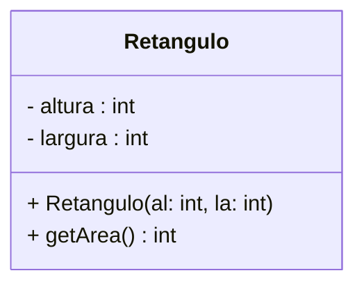
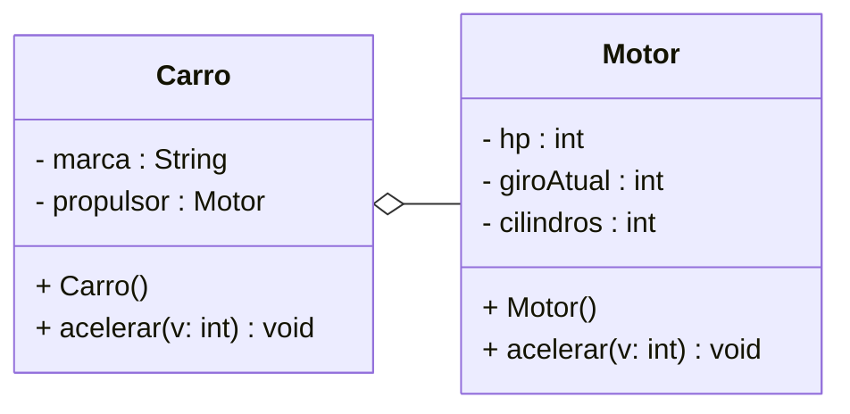
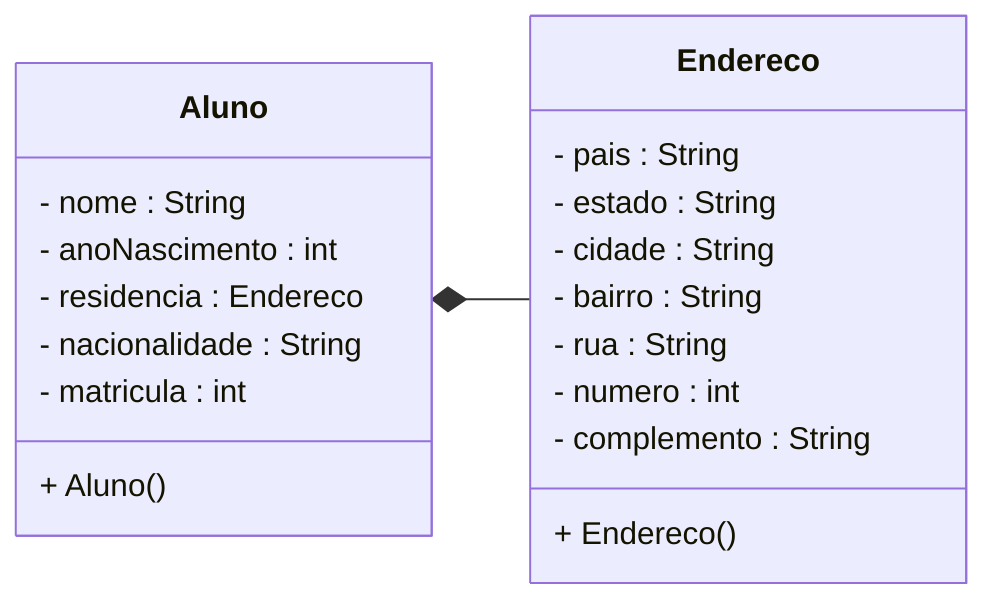
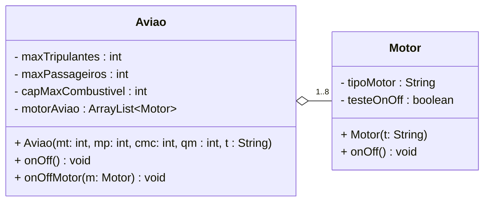

```mermaid
classDiagram
    class Retangulo{
        - altura : int
        - largura : int
        + Retangulo(al: int, la: int)
        + getArea() int
    }
    
```

```mermaid
classDiagram
    direction LR
    
    class Carro{
        - marca : String
        - propulsor : Motor
        + Carro()
        + acelerar(v: int) void
    }
    
    class Motor{
        - hp : int
        - giroAtual : int
        - cilindros : int
        + Motor()
        + acelerar(v: int) void
        }
    
    Carro o-- Motor
```

```mermaid
classDiagram
    direction LR
    
    class Aluno{
        - nome : String 
        - anoNascimento : int
        - residencia : Endereco
        - nacionalidade : String
        - matricula : int
        + Aluno()
    }
    
    class Endereco{
        - pais : String
        - estado : String
        - cidade : String
        - bairro : String
        - rua : String
        - numero : int
        - complemento : String
        + Endereco()
    }
    
 Aluno *-- Endereco 
```

```mermaid
classDiagram
    direction LR
    
    class Aviao{
        - maxTripulantes : int
        - maxPassageiros : int
        - capMaxCombustivel : int
        - motorAviao : ArrayList~Motor~
        + Aviao(mt: int, mp: int, cmc: int, qm : int, t : String) 
        + onOff() void
        + onOffMotor(m: Motor) void
    }

    class Motor{
        - tipoMotor : String
        - testeOnOff : boolean
        + Motor(t: String) 
        + onOff() void
    }
    
    Aviao o-- "1..8"Motor
    
```