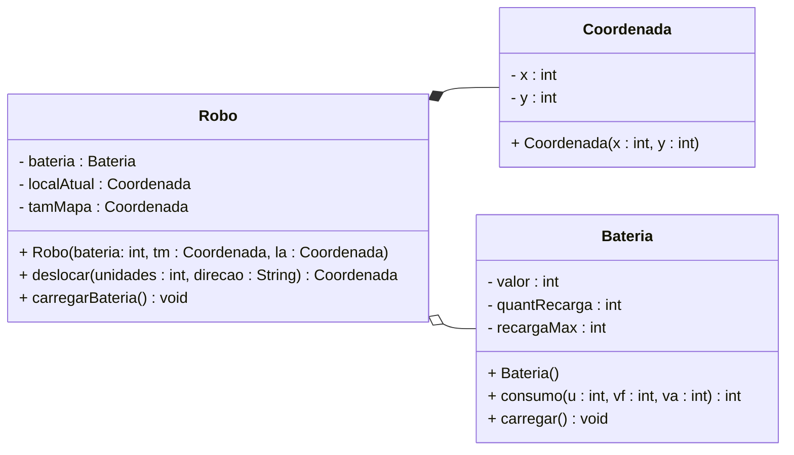

```mermaid
classDiagram
    direction LR
    
    class Robo{
        - bateria : Bateria
        - localAtual : Coordenada
        - tamMapa : Coordenada
        + Robo(bateria: int, tm : Coordenada, la : Coordenada)
        + deslocar(unidades : int, direcao : String) Coordenada
        + carregarBateria() void
    }

    class Coordenada {
        - x : int
        - y : int
        + Coordenada(x : int, y : int)
    }

    class Bateria {
        - valor : int
        - quantRecarga : int
        - recargaMax : int
        + Bateria() 
        + consumo(u : int, vf : int, va : int) int
        + carregar() void
    }

    Robo *-- Coordenada
    Robo o-- Bateria
    
```