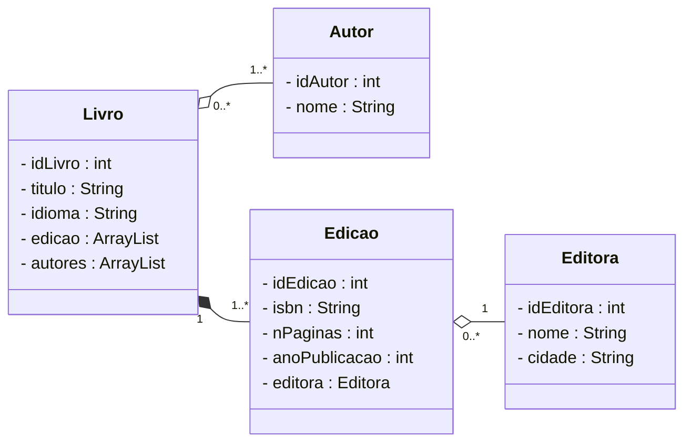
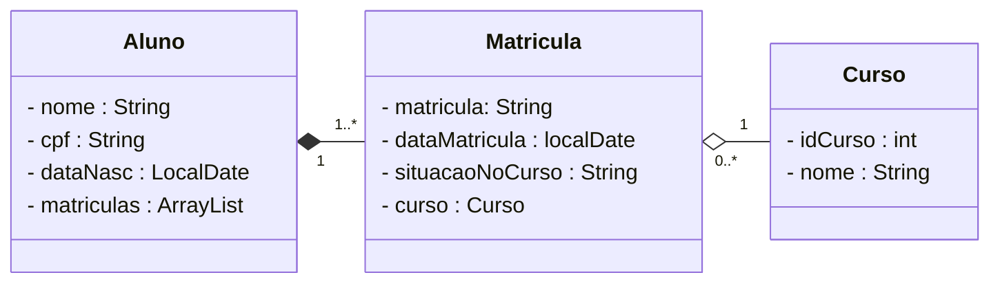
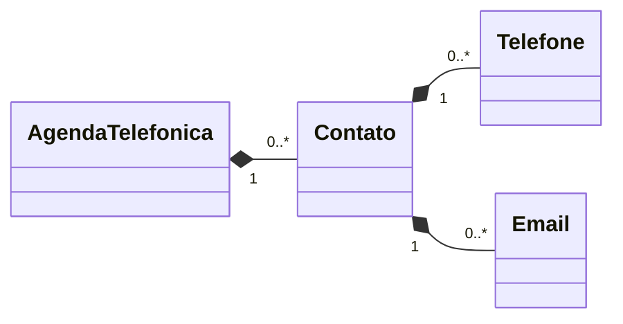

```mermaid
    classDiagram
    direction LR

    class Livro{
        - idLivro : int
        - titulo : String
        - idioma : String
        - edicao : ArrayList<Edicao>
        - autores : ArrayList<Autor>
    }

    class Autor {
        - idAutor : int
        - nome : String
    }

    class Editora {
       - idEditora : int
       - nome : String
       - cidade : String
    }
    
    class Edicao{
        - idEdicao : int
        - isbn : String
        - nPaginas : int
        - anoPublicacao : int
        - editora : Editora
    }

    Livro "0..*"o--"1..*" Autor
    Livro "1"*--"1..*" Edicao
    Edicao "0..*"o--"1" Editora
```

```mermaid
    classDiagram
    direction LR

    class Aluno{
        - nome : String
        - cpf : String
        - dataNasc : LocalDate
        - matriculas : ArrayList<Matricula>
    }
    
    class Matricula{
        - matricula: String
        - dataMatricula : localDate
        - situacaoNoCurso : String
        - curso : Curso
    }
    
    class Curso{
        - idCurso : int
        - nome : String
    }

    Aluno "1"*--"1..*" Matricula
    Matricula "0..*"o--"1" Curso
```

```mermaid
    classDiagram
    direction LR

    class AgendaTelefonica{
        
    }
    
    class Contato{
        
    }
    
    class Telefone{
        
    }
    
    class Email{
        
    }

    AgendaTelefonica "1"*--"0..*" Contato
    Contato "1"*--"0..*" Telefone
    Contato "1"*--"0..*" Email
```