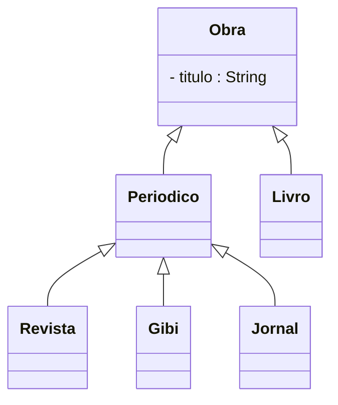
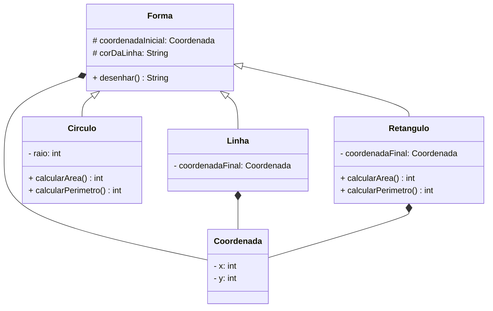

```mermaid
classDiagram

class Obra{
- titulo : String
}

class Periodico{

    }

class Livro{

    }

class Gibi{

    }

class Revista{

    }

class Jornal {

    }

Obra <|-- Livro
Obra <|-- Periodico
Periodico <|-- Revista
Periodico <|-- Gibi
Periodico <|-- Jornal

```

```mermaid
classDiagram

class Forma{
    # coordenadaInicial: Coordenada
    # corDaLinha: String
    + desenhar() String
}

class Coordenada{
    - x: int
    - y: int
}

class Linha{
    - coordenadaFinal: Coordenada
    }

class Circulo{
    - raio: int
    + calcularArea() int
    + calcularPerimetro() int
    }

class Retangulo{ 
    - coordenadaFinal: Coordenada
    + calcularArea() int
    + calcularPerimetro() int
    }

    Forma <|-- Linha
    Forma <|-- Circulo
    Forma <|-- Retangulo
    Forma *-- Coordenada
    Linha *-- Coordenada
    Retangulo *-- Coordenada

```