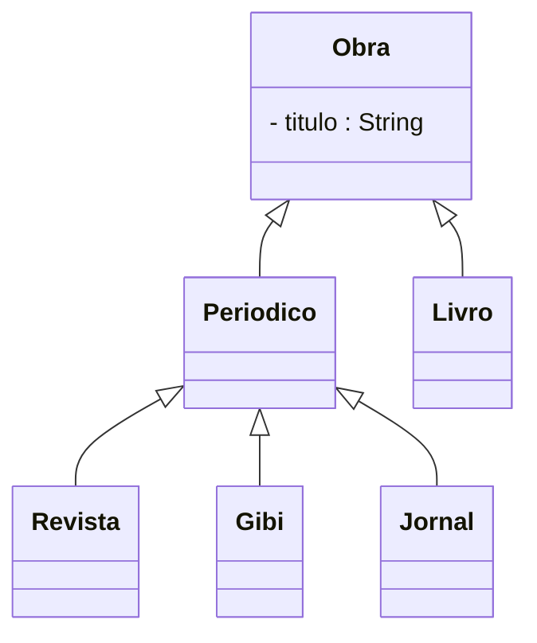
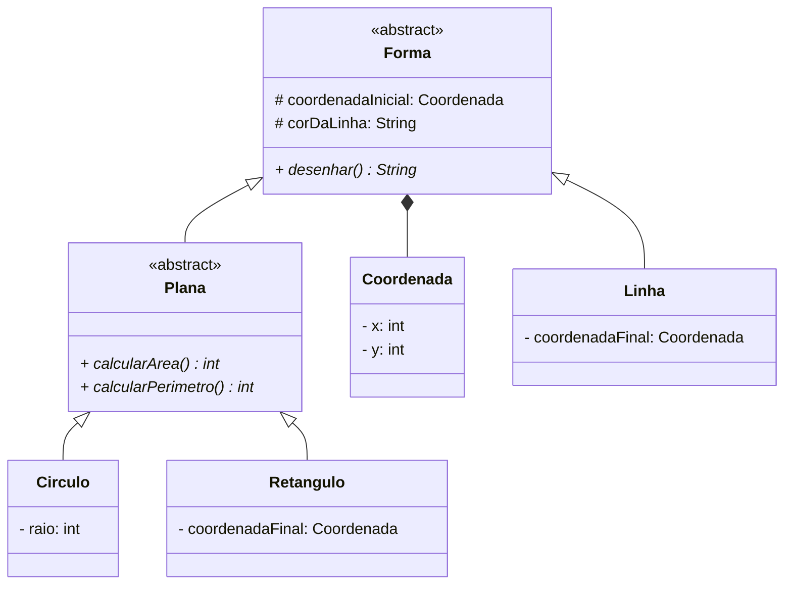
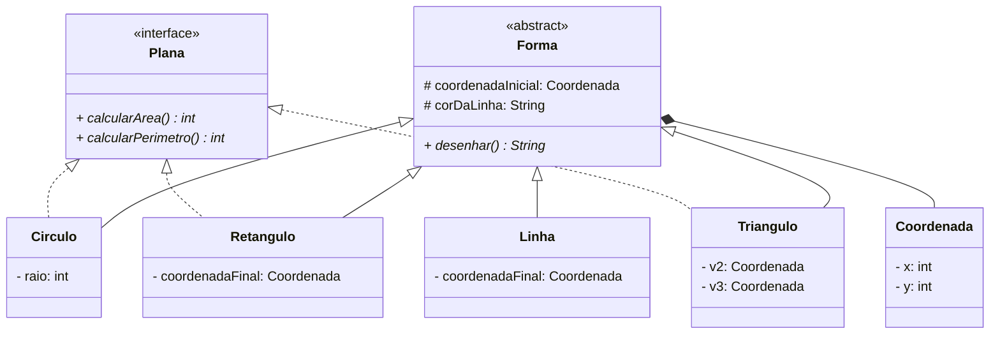

```mermaid
classDiagram

class Obra{
- titulo : String
}

class Periodico{

    }

class Livro{

    }

class Gibi{

    }

class Revista{

    }

class Jornal {

    }

Obra <|-- Livro
Obra <|-- Periodico
Periodico <|-- Revista
Periodico <|-- Gibi
Periodico <|-- Jornal

```

```mermaid
classDiagram

class Forma{
    <<abstract>>
    # coordenadaInicial: Coordenada
    # corDaLinha: String
    + desenhar() String*
}

class Plana{
    <<abstract>>
    + calcularArea() int*
    + calcularPerimetro() int*
}

class Coordenada{
    - x: int
    - y: int
}

class Linha{
    - coordenadaFinal: Coordenada
    }

class Circulo{
    - raio: int
    }

class Retangulo{ 
    - coordenadaFinal: Coordenada
    }

    Forma <|-- Linha
    Forma <|-- Plana
    Plana <|-- Circulo
    Plana <|-- Retangulo
    Forma *-- Coordenada
    

```

```mermaid
classDiagram

class Forma{
    <<abstract>>
    # coordenadaInicial: Coordenada
    # corDaLinha: String
    + desenhar() String*
}

class Plana{
    <<interface>>
    + calcularArea() int*
    + calcularPerimetro() int*
}

class Coordenada{
    - x: int
    - y: int
}

class Linha{
    - coordenadaFinal: Coordenada
    }

class Circulo{
    - raio: int
    }

class Retangulo{ 
    - coordenadaFinal: Coordenada
    }
    
    class Triangulo{
        - v2: Coordenada
        - v3: Coordenada
    }

    Plana <|.. Retangulo
    Plana <|.. Circulo
    Plana <|.. Triangulo
    Forma <|-- Circulo
    Forma <|-- Retangulo
    Forma <|-- Linha
    Forma <|-- Triangulo
    Forma *-- Coordenada
    

```