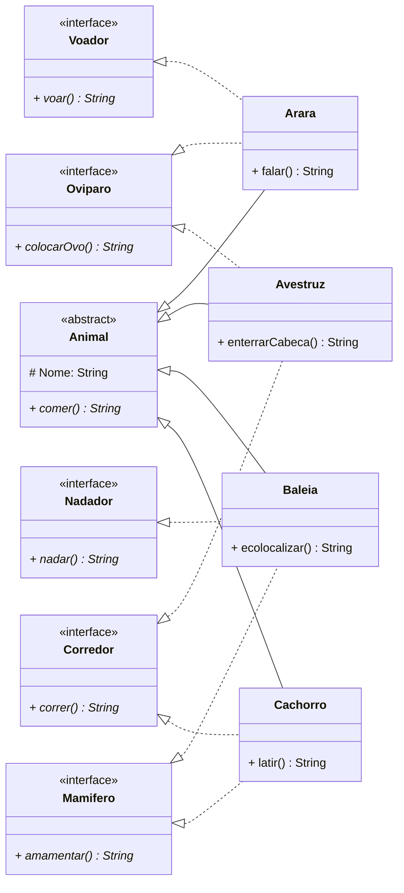

```mermaid
classDiagram
    direction LR

    class Animal {
        <<abstract>>
        # Nome: String
        + comer() String*
    }

    class Voador {
        <<interface>>
        + voar() String*
    }

    class Oviparo {
        <<interface>>
        + colocarOvo() String*
    }

    class Mamifero {
        <<interface>>
        + amamentar() String*
    }

    class Nadador {
        <<interface>>
        + nadar() String*
    }

    class Corredor {
        <<interface>>
        + correr() String*
    }

    class Arara {
        + falar() String
    }

    class Avestruz {
        + enterrarCabeca() String
    }

    class Baleia {
        + ecolocalizar() String
    }

    class Cachorro {
        + latir() String
    }

    Animal <|-- Arara
    Voador <|.. Arara
    Oviparo <|.. Arara
    Animal <|-- Avestruz
    Corredor <|.. Avestruz
    Oviparo <|.. Avestruz
    Animal <|-- Baleia
    Nadador <|.. Baleia
    Mamifero <|.. Baleia
    Animal <|-- Cachorro
    Corredor <|.. Cachorro
    Mamifero <|.. Cachorro


```