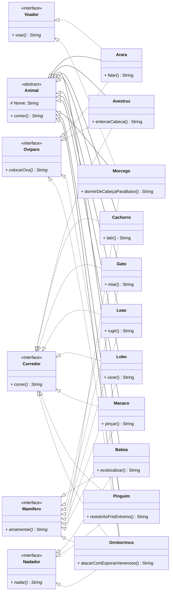

```mermaid
classDiagram
    direction LR

    class Animal {
        <<abstract>>
        # Nome: String
        + comer() String*
    }

    class Voador {
        <<interface>>
        + voar() String*
    }

    class Oviparo {
        <<interface>>
        + colocarOvo() String*
    }

    class Mamifero {
        <<interface>>
        + amamentar() String*
    }

    class Nadador {
        <<interface>>
        + nadar() String*
    }

    class Corredor {
        <<interface>>
        + correr() String*
    }

    class Arara {
        + falar() String
    }

    class Avestruz {
        + enterrarCabeca() String
    }

    class Baleia {
        + ecolocalizar() String
    }

    class Cachorro {
        + latir() String
    }
    
    class Gato{
        + miar() String
    }

    class Leao{
        + rugir() String
    }

    class Lobo{
        + uivar() String
    }

    class Macaco{
        + pinçar() String
    }

    class Morcego{
        + dormirDeCabeçaParaBaixo() String
    }

    class Pinguim{
        + resistirAoFrioExtremo() String
    }

    class Ornitorrinco{
        + atacarComEsporaoVenenoso() String
    }

    Animal <|-- Arara
    Voador <|.. Arara
    Oviparo <|.. Arara
    Animal <|-- Avestruz
    Corredor <|.. Avestruz
    Oviparo <|.. Avestruz
    Animal <|-- Baleia
    Nadador <|.. Baleia
    Mamifero <|.. Baleia
    Animal <|-- Cachorro
    Corredor <|.. Cachorro
    Mamifero <|.. Cachorro
    Animal <|-- Gato
    Corredor <|.. Gato
    Mamifero <|.. Gato
    Animal <|-- Leao
    Corredor <|.. Leao
    Mamifero <|.. Leao
    Animal <|-- Lobo
    Corredor <|.. Lobo
    Mamifero <|.. Lobo
    Animal <|-- Macaco
    Corredor <|.. Macaco
    Mamifero <|.. Macaco
    Animal <|-- Morcego
    Voador <|.. Morcego
    Mamifero <|.. Morcego
    Animal <|-- Pinguim
    Corredor <|.. Pinguim
    Nadador <|.. Pinguim
    Oviparo <|.. Pinguim
    Animal <|-- Ornitorrinco
    Corredor <|.. Ornitorrinco
    Nadador <|.. Ornitorrinco
    Oviparo <|.. Ornitorrinco
    Mamifero <|.. Ornitorrinco
    


```