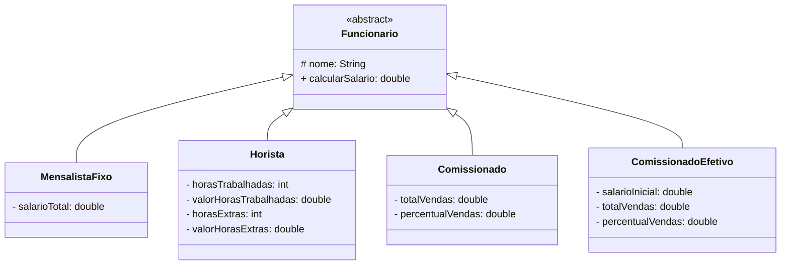

```mermaid
classDiagram
    class Funcionario{
        <<abstract>>
        # nome: String
        + calcularSalario: double
    }

    class MensalistaFixo{
        - salarioTotal: double
    }
    
    class Horista{
        - horasTrabalhadas: int
        - valorHorasTrabalhadas: double
        - horasExtras: int
        - valorHorasExtras: double
    }

    class Comissionado{
        - totalVendas: double
        - percentualVendas: double
    }

    class ComissionadoEfetivo{
        - salarioInicial: double
        - totalVendas: double
        - percentualVendas: double
    }
    
    Funcionario <|-- MensalistaFixo
    Funcionario <|-- Horista
    Funcionario <|-- Comissionado
    Funcionario <|-- ComissionadoEfetivo

```