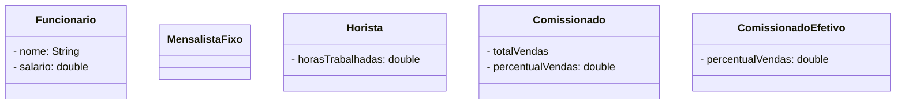

```mermaid
classDiagram
    class Funcionario{
        - nome: String
        - salario: double
    }

    class MensalistaFixo{
       
    }
    
    class Horista{
        - horasTrabalhadas: double
    }

    class Comissionado{
        - totalVendas
        - percentualVendas: double
    }

    class ComissionadoEfetivo{
        - percentualVendas: double
    }

```