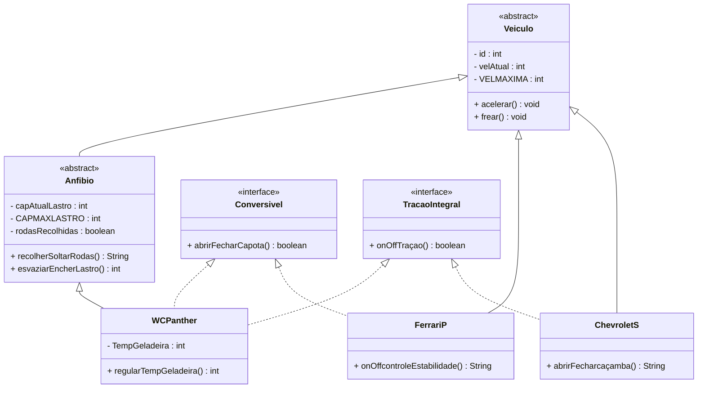

```mermaid
classDiagram
    class Veiculo{
        <<abstract>>
        - id : int
        - velAtual : int
        - VELMAXIMA : int
        + acelerar() void
        + frear() void
    }
    
    class Anfibio{
        <<abstract>>
        - capAtualLastro : int
        - CAPMAXLASTRO : int
        - rodasRecolhidas : boolean
        + recolherSoltarRodas() String
        + esvaziarEncherLastro() int
    }
    
    class Conversivel{
        <<interface>>
        + abrirFecharCapota() boolean
    }

    class TracaoIntegral{
        <<interface>>
        + onOffTraçao() boolean
    }
    
    class FerrariP{
        + onOffcontroleEstabilidade() String
    }
    
    class ChevroletS{
        + abrirFecharcaçamba() String
    }
    
    class WCPanther{
        - TempGeladeira : int
        + regularTempGeladeira() int
    }

    Veiculo <|-- Anfibio
    Veiculo <|-- FerrariP
    
    Veiculo <|-- ChevroletS
    Anfibio <|-- WCPanther
    Conversivel <|.. WCPanther
    
    Conversivel <|.. FerrariP
    
    TracaoIntegral <|.. WCPanther
    TracaoIntegral <|.. ChevroletS

```